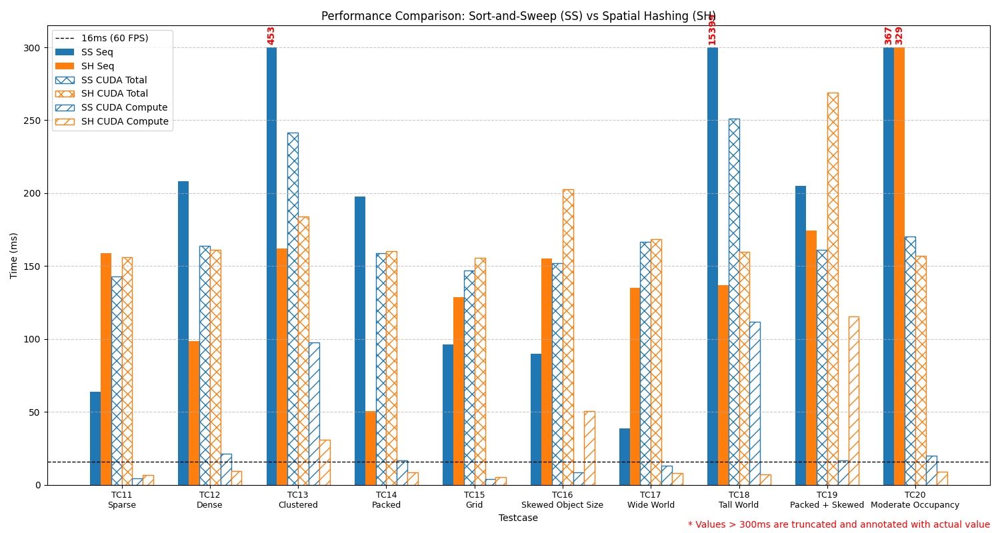

# Collision Detection
## Parallel Programming Final Project, Group 1

---
# What is Collision Detection?
Detect intersections of two or more objects.
- Real-time simulations need fast detection (≪ 16.67 ms for 60 FPS).
- Brute force requires $O(N^2)$ pairwise checks for $N$ objects.

$\rightarrow$ Reduce and parallelize pairwise checks.

---
# Project Overview

**Scope**: 2D bounding box
**Algorithms**: 
  - Sort-and-Sweep
  - Spatial Hashing

**Implementation**: CPU and GPU
**Benchmark**: 10 custom testcases of 100k~200k boxes

---
# Sort-and-Sweep
**Idea: Reduce pairwise checks by sorting boxes along one axis.**

1. Sort boxes along one axis.
2. Sweep across the sorted list.
3. Maintain an active list of boxes that intersect the sweep line.
4. Check for overlaps **only** among boxes **in the active list**.

---
# Spatial Hashing
**Idea: Reduce pairwise checks by partitioning space into a grid.**

- Divide space into a grid of cells.
- Hash boxes into cells based on their positions.
- Only check for collisions among boxes within the **same or neighboring cells**.

---
# Benchmark Results

---
# Discussion
- Memory transfer overhead dominates parallel performance.
- Parallelization prevents worst-case scenarios (e.g., TC18: 15s vs 0.25s).
- GPU compute consistently under 16ms (60 FPS), indicating high efficiency if data transfer is minimized.

---
# Conclusion
- GPU collision detection excels with GPU-resident physics pipelines.
- But offers limited benefit when frequent CPU-GPU synchronization is required.

---
# Team Members and Work Distribution
| Task                     | Member               |
|--------------------------|-------------------------|
| Dataset Generation       | CHUN-SING, NG (b11902117)           |
| Sequential Implementations | CHUN-SING, NG (b11902117)         |
| CUDA Sort-and-Sweep     | GUAN-CHEN, LIN (b12902154)          |
| CUDA Spatial Hashing    | SHENG, YU (r14922110)               |
| Report Writing          | CHUN-SING, NG (b11902117)           |
| Slide Preparation       | CHUN-SING, NG (b11902117)           |
| Presentation            | SHENG, YU (r14922110)               |

---
# References
Karras, Tero. 2012. Thinking Parallel, Part I: Collision Detection on the GPU. https://developer.nvidia.com/blog/thinking-parallel-part-i-collision-detection-gpu/

---
# Q & A
Thank you for your attention!