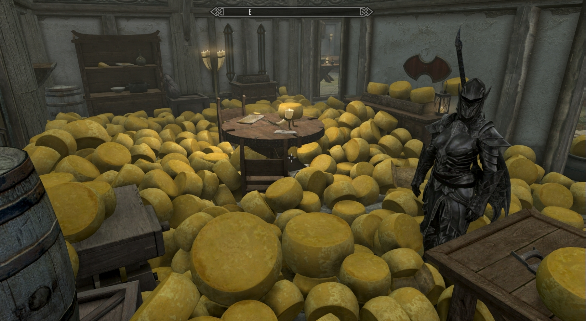
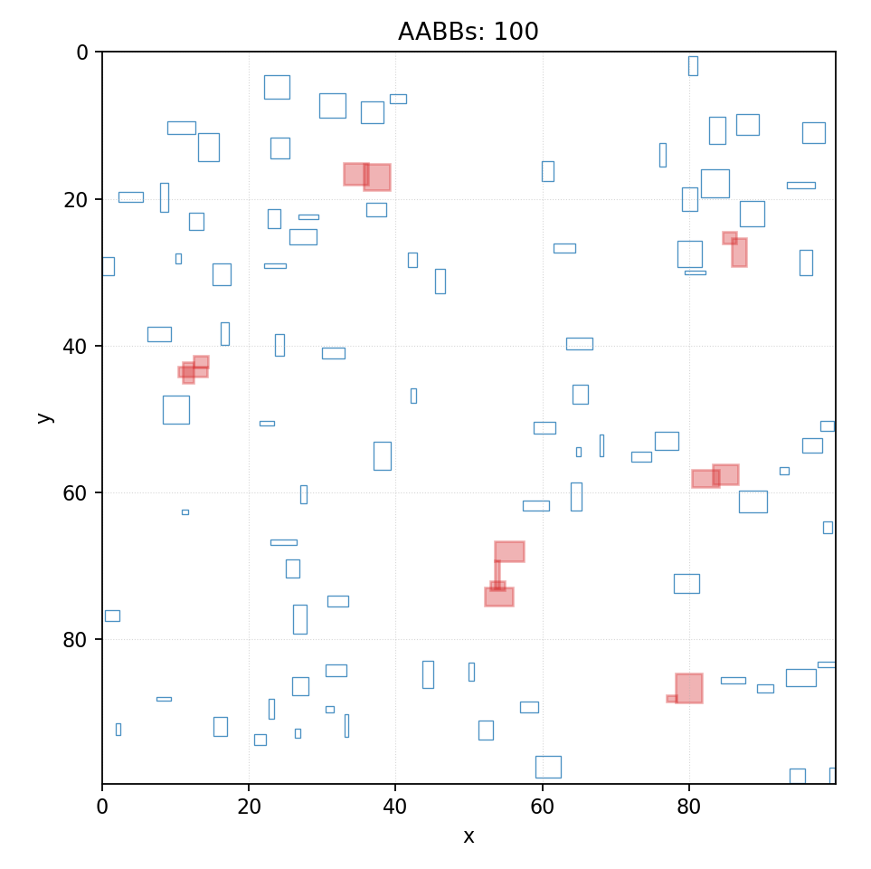

# Collision Detection
## Parallel Programming Final Project, Group 1

---
# Background

---
# What is Collision Detection?
Detect intersections of two or more objects.
- Fundamental problem in computer graphics and physical simulations.
- Brute force requires $O(N^2)$ pairwise checks for $N$ objects.

---
# Why optimization?
Real-time constraint.

- 16.67 ms for 60 FPS game.
- Collision detection is just one part of the frame processing.

Reduce pairwise checks!

---
# Broad-phase vs. Narrow-phase
- **Broad-phase**: Use simple bounding volumes to eliminate unlikely pairs.
- **Narrow-phase**: Use precise geometric tests.

---
# Project Overview

---
# Scope
- Broad-phase.
- Axis-Aligned Bounding Boxes (AABB).
- 2D space.
- Implement and compare:
  - Sort and Sweep
  - Spatial Hashing

---
# Dataset
10 testcases of 100k to 200k boxes with varying box distributions:
- Sparse vs Dense
- Clustered vs Uniform
- Skewed box sizes
- Extreme aspect ratios

---
# Algorithms

---
# Sort-and-Sweep

---
# Idea
- Sort boxes along one axis.
- Sweep a line across the sorted list.
- Maintain an active list of boxes that intersect the sweep line.
- Check for overlaps **only** among boxes **in the active list**.

---
# Spatial Hashing

---
# Idea
- Divide space into a grid of cells.
- Hash boxes into cells based on their positions.
- Only check for collisions among boxes within the **same or neighboring cells**.

---
# Results
TODO: compare results here with bar charts or tables.

---
# Discussion

---
# Team Members and Work Distribution
| Task                     | Member               |
|--------------------------|-------------------------|
| Dataset Generation       | CHUN-SING, NG (b11902117)           |
| Sequential Implementations | CHUN-SING, NG (b11902117)         |
| CUDA Sort-and-Sweep     | GUAN-CHEN, LIN (b12902154)          |
| CUDA Spatial Hashing    | SHENG, YU (r14922110)               |

---
# References
Karras, Tero. 2012. Thinking Parallel, Part I: Collision Detection on the GPU. https://developer.nvidia.com/blog/thinking-parallel-part-i-collision-detection-gpu/